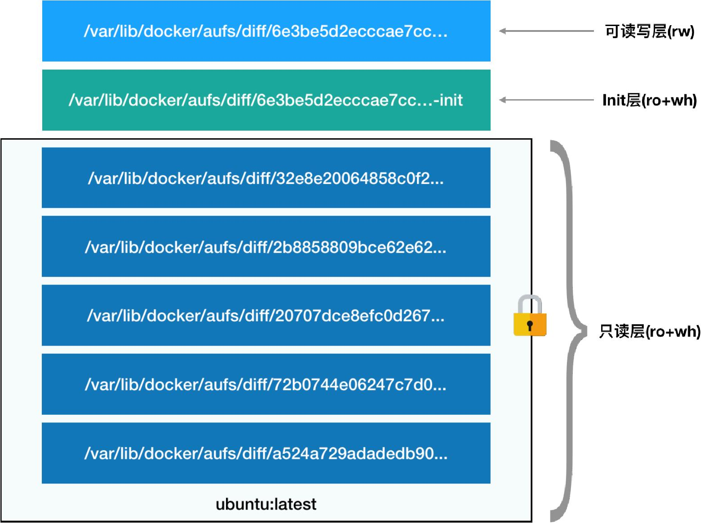

# Docker
我们知道 Docker 是基于 Cgroups 和 Namespace 机制创建一个叫做“沙盒”的隔离环境。这个用来运行应用的隔离环境就是所谓的“容器”。

但是在Docker 之前就已经有成熟的 PaaS 项目，比如 Cloud Foundry。Docker 与 Cloud Foundry 的容器都是基于 Cgroups 和 Namespace ，大部分功能
和实现原理基本上都是一样的饿。Docker 为什么可以迅速崛起？

原因就是 Docker 独有的功能 **Docker 镜像**。

PaaS 项目可以帮助用户大规模部署应用到集群，但是它的打包功能是一个饱受诟病的“软肋”。使用 PaaS 用户必须为每种语言，每种框架甚至每个版本打包，而且应用在本地环境
运行的好好的在 PaaS 里就运行不了，需要不断试错，修改配置。

**Docker 镜像**解决的就是这个打包问题。**Docker 镜像**。本质上就是一个压缩包，但是这个压缩包包含了一个完整的操作系统的文件和目录，所以这个压缩包的内容和本地环境
是完全一样的。在云端环境，不再需要多余的修改和配置，可以使用某种技术创建一个沙盒，解压这个压缩包，就可以运行应用了。本地环境和云端环境高度一致，这就是Docker 镜像的
精髓。

## 容器基础
容器其实就是一种沙盒技术。沙盒就像一个集装箱，把你的应用装起来，这样应用和应用之间互不干扰，并且这个集装箱应用可以很方便的搬来搬去。

容器技术的核心就是通过约束和修改进程的动态表现，从而为其创造出一个“边界”。对于Docker 容器，**Cgroups 技术（控制组 Control groups）**是用来制造约束的主要手段，
**Namespace 技术**是用来修改进程视图的主要方法。

### Namespace
```bash
docker run -it busybox /bin/sh
```
这里运行了一个容器，并且分配了一个命令行终端来和容器交互。执行`ps`命令，会输出：
```bash
PID USER TIME COMMAND
1   root  0:00  /bin/sh
10  root  0:00  ps
```

`/bin/sh`是容器内部的 1 号进程，这就意味着`/bin/sh`和`ps`已经被docker 与宿主机隔离。

怎么隔离？

本来，每当我们在宿主机上运行了一个`/bin/sh`程序，操作系统都会给它分配一个进程编号，比如`PID=100`。这个编号是进程的唯一标识，就像员工的工牌一样。所以`PID=100`，
可以粗略地理解为这个`/bin/sh`是我们公司里的第 100 号员工，而第 1 号员工就自然是老板。而现在，我们要通过Docker 把这个`/bin/sh`程序运行在一个容器当中。
这时候，Docker 就会在这个第 100 号员工入职时给他施一个“障眼法”，让他永远看不到前面的其他 99 个员工，更看不到老板。这样，他就会错误地以为自己就是公司里的第 1 号员工。
这种机制，其实就是对被隔离应用的进程空间做了手脚，使得这些进程只能看到重新计算过的进程编号，比如`PID=1`。可实际上，他们在宿主机的操作系统里，还是原来的第100 号进程。

**这种技术，就是Linux 里面的Namespace 机制。**

每个 PID Namespace 里的应用进程，都会认为自己是当前容器里的第 1 号进程，它们既看不到宿主机里真正的进程空间，也看不到其他PID Namespace 里的具体情况。

除了 PID Namespace，Linux 操作系统还提供了Mount、UTS、IPC、Network 和 User 这些Namespace，用来对各种不同的进程上下文进行“障眼法”操作。
比如，Mount Namespace，用于让被隔离进程只看到当前Namespace 里的挂载点信息；Network Namespace，用于让被隔离进程看到当前Namespace 里的网络设备和配置。

这就是Linux 容器最基本的实现原理了。所以说，**容器，其实是一种特殊的进程**。

### Cgroups

基于Linux Namespace 的隔离机制相比于虚拟化技术也有很多不足之处，其中最主要的问题就是：隔离得不彻底。

首先，既然容器只是运行在宿主机上的一种特殊的进程，那么多个容器之间使用的就还是同一个宿主机的操作系统内核。
这意味着，如果你要在 Windows 宿主机上运行Linux 容器，或者在低版本的Linux 宿主机上运行高版本的Linux 容器，都是行不通的。

其次，在Linux 内核中，有很多资源和对象是不能被Namespace 化的，最典型的例子就是：时间。
这就意味着，如果你的容器中的程序使用`settimeofday(2)`系统调用修改了时间，整个宿主机的时间都会被随之修改，这显然不符合用户的预期。

#### 限制
为什么需要对容器做“限制”呢？

以PID Namespace 为例，来给你解释这个问题。

虽然容器内的第1 号进程在“障眼法”的干扰下只能看到容器里的情况，但是宿主机上，它作为第100 号进程与其他所有进程之间依然是平等的竞争关系。这就意味着，虽然第100 号进程
表面上被隔离了起来，但是它所能够使用到的资源（比如CPU、内存），却是可以随时被宿主机上的其他进程（或者其他容器）占用的。当然，这个100 号进程自己也可能把所有资源吃
光。这些情况，显然都不是一个“沙盒”应该表现出来的合理行为。

**Linux Cgroups 就是Linux 内核中用来为进程设置资源限制的一个重要功能。**Linux Cgroups 的全称是Linux Control Group。它最主要的作用，就是限制一个进程组能够
使用的资源上限，包括CPU、内存、磁盘、网络带宽等等。


一个正在运行的Docker 容器，其实就是一个启用了多个Linux Namespace 的应用进程，而这个进程能够使用的资源量，则受 Cgroups 配置的限制。

在Linux 中，Cgroups 给用户暴露出来的操作接口是文件系统，即它以文件和目录的方式组织在操作系统的`/sys/fs/cgroup`路径下。

```bash
$ mount -t cgroup
cpuset on /sys/fs/cgroup/cpuset type cgroup (rw,nosuid,nodev,noexec,relatime,cpuset)
cpu on /sys/fs/cgroup/cpu type cgroup (rw,nosuid,nodev,noexec,relatime,cpu)
cpuacct on /sys/fs/cgroup/cpuacct type cgroup (rw,nosuid,nodev,noexec,relatime,cpuacct)
blkio on /sys/fs/cgroup/blkio type cgroup (rw,nosuid,nodev,noexec,relatime,blkio)
memory on /sys/fs/cgroup/memory type cgroup (rw,nosuid,nodev,noexec,relatime,memory)
...
```

在`/sys/fs/cgroup`下面有很多诸如cpuset、cpu、memory 这样的子目录，也叫子系统。这些都是我这台机器当前可以被Cgroups 进行限制的资源种类。而在子系统对应的资
源种类下，你就可以看到该类资源具体可以被限制的方法。比如，对CPU 子系统来说，我们就可以看到如下几个配置文件：
```bash
$ ls /sys/fs/cgroup/cpu
cgroup.clone_children cpu.cfs_period_us cpu.rt_period_us cpu.shares notify_on_release
cgroup.procs cpu.cfs_quota_us cpu.rt_runtime_us cpu.stat tasks
```

注意到`cfs_period`和`cfs_quota`这样的关键词。这两个参数需要组合使用，可以用来限制进程在长度为`cfs_period`的一段时间内，只能被分配到总量为`cfs_quota`的CPU 时间。

这样的配置文件又如何使用？
你需要在对应的子系统下面创建一个目录，比如，我们现在进入/sys/fs/cgroup/cpu 目录下：
```bash
root@ubuntu:/sys/fs/cgroup/cpu$ mkdir container
root@ubuntu:/sys/fs/cgroup/cpu$ ls container/
cgroup.clone_children cpu.cfs_period_us cpu.rt_period_us cpu.shares notify_on_release
cgroup.procs cpu.cfs_quota_us cpu.rt_runtime_us cpu.stat tasks
```
**这个目录就称为一个“控制组”。你会发现，操作系统会在你新创建的`container`目录下，自动生成该子系统对应的资源限制文件。**
现在，我们在后台执行一个死循环，计算机的CPU 吃到100%：
```bash
$ while : ; do : ; done &
[1] 226
```

我们可以通过查看`container`目录下的文件，看到`container`控制组里的CPU quota还没有任何限制（即：`-1`），CPU period 则是默认的`100 ms`（`100000 us`）：
```bash
$ cat /sys/fs/cgroup/cpu/container/cpu.cfs_quota_us
-1
$ cat /sys/fs/cgroup/cpu/container/cpu.cfs_period_us
100000
```

修改这些文件的内容来设置限制，比如，向container 组里的cfs_quota 文件写入20 ms（20000 us）：
```bash
$ echo 20000 > /sys/fs/cgroup/cpu/container/cpu.cfs_quota_us
```

结合前面的介绍，你应该能明白这个操作的含义，它意味着在每100 ms 的时间里，被该控制组限制的进程只能使用20 ms 的CPU 时间，也就是说这个进程只能使用到20% 的CPU 带宽。

接下来，我们把被限制的进程的`PID`写入`container`组里的`tasks`文件，上面的设置就会对该进程生效了：
```bash
$ echo 226 > /sys/fs/cgroup/cpu/container/tasks

# 用top 指令查看一下
$ top
%Cpu0 : 20.3 us, 0.0 sy, 0.0 ni, 79.7 id, 0.0 wa, 0.0 hi, 0.0 si, 0.0 st
```
可以看到，计算机的CPU 使用率立刻降到了20%（%Cpu0 : 20.3 us）。

Cgroups 的每一项子系统都有其独有的资源限制能力，比如：
- `blkio`，为块设备设定`I/O`限制，一般用于磁盘等设备；
- `cpuset`，为进程分配单独的CPU 核和对应的内存节点；
- `memory`，为进程设定内存使用的限制。

Linux Cgroups 的设计还是比较易用的，**它其实就是一个子系统目录加上一组资源限制文件的组合。**

而对于Docker 等Linux 容器项目来说，**它们只需要在每个子系统下面，为每个容器创建一个控制组（即创建一个新目录），然后在启动容器进程之后，把这个进程的PID 填写
到对应控制组的tasks 文件中就可以了。**

而至于在这些控制组下面的资源文件里填上什么值，就靠用户执行`docker run`时的参数指定了，比如这样一条命令：
```bash
$ docker run -it --cpu-period=100000 --cpu-quota=20000 ubuntu /bin/bash
```

在启动这个容器后，我们可以通过查看Cgroups 文件系统下，CPU 子系统中，“docker”这个控制组里的资源限制文件的内容来确认：
```bash
$ cat /sys/fs/cgroup/cpu/docker/5d5c9f67d/cpu.cfs_period_us
100000
$ cat /sys/fs/cgroup/cpu/docker/5d5c9f67d/cpu.cfs_quota_us
20000
```
意味着这个Docker 容器，只能使用到20% 的CPU 带宽。


#### Cgroups的问题
跟Namespace 的情况类似，Cgroups 对资源的限制能力也有很多不完善的地方，被提及最多的自然是`/proc`文件系统的问题。

众所周知，Linux 下的`/proc`目录存储的是记录当前内核运行状态的一系列特殊文件，用户可以通过访问这些文件，查看系统以及当前正在运行的进程的信息，比如CPU 使用情况、
内存占用率等，这些文件也是`top`指令查看系统信息的主要数据来源。但是，你如果在容器里执行`top`指令，就会发现，它显示的信息居然是宿主机的CPU 和内存数据，而不是
当前容器的数据。

造成这个问题的原因就是，`/proc`文件系统并不知道用户通过Cgroups 给这个容器做了什么样的资源限制，即：`/proc`文件系统不了解Cgroups 限制的存在。在生产环境中，
这个问题必须进行修正，否则应用程序在容器里读取到的CPU 核数、可用内存等信息都是宿主机上的数据，这会给应用的运行带来非常大的困惑和风险。这也是在企业中，容器化应用
碰到的一个常见问题，也是容器相较于虚拟机另一个不尽如人意的地方。

解决方案 **lxcfs**：
`top`是从`/prof/stats`目录下获取数据，所以道理上来讲，容器不挂载宿主机的该目录就可以了。`lxcfs`就是来实现这个功能的，做法是把宿主机的`/var/lib/lxcfs/proc/memoinfo`
文件挂载到Docker容器的`/proc/meminfo`位置后。容器中进程读取相应文件内容时，`LXCFS`的`FUSE`实现会从容器对应的Cgroup中读取正确的内存限制。从而使得应用获得正确的资源约
束设定。kubernetes 环境下，也能用，以`ds`方式运行`lxcfs`，自动给容器注入正确的`proc`信息。

### 镜像
容器里面的文件系统是什么样子的？

可能你立刻就能想到，这一定是一个关于Mount Namespace 的问题：容器里的应用进程，理应看到一份完全独立的文件系统。这样，它就可以在自己的容器目录（比如`/tmp`）下进行操
作，而完全不会受宿主机以及其他容器的影响。

但是其实**即使开启了Mount Namespace，容器进程看到的文件系统也跟宿主机完全一样。**

仔细思考一下，你会发现这其实并不难理解：Mount Namespace 修改的是容器进程对文件系统“挂载点”的认知。但是，这也就意味着，只有在“挂载”这个操作发生之后，进程的视图
才会被改变。而在此之前，新创建的容器会直接继承宿主机的各个挂载点。

这时，你可能已经想到了一个解决办法：创建新进程时，除了声明要启用Mount Namespace之外，我们还可以告诉容器进程，有哪些目录需要重新挂载，就比如这个`/tmp`目录。

**这就是Mount Namespace 跟其他Namespace 的使用略有不同的地方：它对容器进程视图的改变，一定是伴随着挂载操作（mount）才能生效。**

可是，作为一个普通用户，我们希望的是一个更友好的情况：每当创建一个新容器时，我希望容器进程看到的文件系统就是一个独立的隔离环境，而不是继承自宿主机的文件系统。怎么才能做
到这一点呢？

不难想到，我们可以在容器进程启动之前重新挂载它的整个根目录`/`。而由于Mount Namespace 的存在，这个挂载对宿主机不可见，所以容器进程就可以在里面随便折腾了。

Linux 操作系统里，有一个名为`chroot`的命令可以帮助你在shell 中方便地完成这个工作。顾名思义，它的作用就是帮你“change root file system”，即改变进程的根目录到你指定的
位置。它的用法也非常简单。

假设，我们现在有一个`$HOME/test`目录，想要把它作为一个`/bin/bash`进程的根目录。首先，创建一个`test`目录和几个`lib`文件夹：
```bash
$ mkdir -p $HOME/test
$ mkdir -p $HOME/test/{bin,lib64,lib}
$ cd $T

# 把bash 命令拷贝到test 目录对应的bin 路径下
$ cp -v /bin/{bash,ls} $HOME/test/bin

# 接下来，把bash 命令需要的所有so 文件，也拷贝到test 目录对应的lib 路径下。找到so 文
# 件可以用ldd 命令：
$ T=$HOME/test
$ list="$(ldd /bin/ls | egrep -o '/lib.*\.[0-9]')"
$ for i in $list; do cp -v "$i" "${T}${i}"; done

# 执行chroot 命令，告诉操作系统，我们将使用$HOME/test 目录作为/bin/bash 进程
# 的根目录
$ chroot $HOME/test /bin/bash
```
这时，你如果执行"ls /"，就会看到，它返回的都是`$HOME/test`目录下面的内容，而不是宿主机的内容，对于被`chroot`的进程来说，它并不会感受到自己的根目录已经被“修改”成
`$HOME/test`了。是不是跟我之前介绍的Linux Namespace 很类似呢？

实际上，Mount Namespace 正是基于对`chroot`的不断改良才被发明出来的，它也是Linux操作系统里的第一个Namespace。

当然，为了能够让容器的这个根目录看起来更“真实”，我们一般会在这个容器的根目录下挂载一个完整操作系统的文件系统，比如Ubuntu16.04 的ISO。这样，在容器启动之后，我们在容
器里通过执行"ls /" 查看根目录下的内容，就是Ubuntu 16.04 的所有目录和文件。

**而这个挂载在容器根目录上、用来为容器进程提供隔离后执行环境的文件系统，就是所谓的“容器镜像”。它还有一个更为专业的名字，叫作：rootfs（根文件系统）。**

所以，一个最常见的`rootfs`，或者说容器镜像，会包括如下所示的一些目录和文件，比如`/bin`，`/etc`，`/proc`等等：
```bash
$ ls /
bin dev etc home lib lib64 mnt opt proc root run sbin sys tmp usr var
```

而你进入容器之后执行的`/bin/bash`，就是`/bin`目录下的可执行文件，与宿主机的`/bin/bash`完全不同。

现在，你应该可以理解，**对Docker 项目来说，它最核心的原理实际上就是为待创建的用户进程**：
1. **启用Linux Namespace 配置**；
2. **设置指定的Cgroups 参数**；
3. **切换进程的根目录（Change Root）**。

这样，一个完整的容器就诞生了。不过，Docker 项目在最后一步的切换上会优先使用`pivot_root`系统调用，如果系统不支持，才会使用`chroot`。

**`rootfs`只是一个操作系统所包含的文件、配置和目录，并不包括操作系统内核。在Linux 操作系统中，这两部分是分开存放的，操作系统只有在开机启动时才会加载
指定版本的内核镜像。**所以说，`rootfs`只包括了操作系统的“躯壳”，并没有包括操作系统的“灵魂”。

对于容器来说，这个操作系统的“灵魂”又在哪里呢？

**实际上，同一台机器上的所有容器，都共享宿主机操作系统的内核。**

这就意味着，如果你的应用程序需要配置内核参数、加载额外的内核模块，以及跟内核进行直接的交互，你就需要注意了：这些操作和依赖的对象，都是宿主机操作系统的内核，它对于该机器
上的所有容器来说是一个“全局变量”，牵一发而动全身。

这也是容器相比于虚拟机的主要缺陷之一：毕竟后者不仅有模拟出来的硬件机器充当沙盒，而且每个沙盒里还运行着一个完整的Guest OS 给应用随便折腾。

不过，正是由于rootfs 的存在，容器才有了一个被反复宣传至今的重要特性：一致性。

#### 一致性
由于云端与本地服务器环境不同，应用的打包过程，一直是使用PaaS 时最“痛苦”的一个步骤。容器镜像（即rootfs）非常优雅地解决了这个问题。

**由于rootfs 里打包的不只是应用，而是整个操作系统的文件和目录，也就意味着，应用以及它运行所需要的所有依赖，都被封装在了一起。**

**对一个应用来说，操作系统本身才是它运行所需要的最完整的“依赖库”。**

有了容器镜像“打包操作系统”的能力，这个最基础的依赖环境也终于变成了应用沙盒的一部分。这就赋予了容器所谓的一致性：无论在本地、云端，还是在一台任何地方的机器上，用户只
需要解压打包好的容器镜像，那么这个应用运行所需要的完整的执行环境就被重现出来了。

**这种深入到操作系统级别的运行环境一致性，打通了应用在本地开发和远端执行环境之间难以逾越的鸿沟。**

#### 联合文件系统（Union File System）
难道我每开发一个应用，或者升级一下现有的应用，都要重复制作一次rootfs 吗？

**Docker 在镜像的设计中，引入了层（layer）的概念。也就是说，用户制作镜像的每一步操作，都会生成一个层，也就是一个增量rootfs。**

Union File System 也叫UnionFS，最主要的功能是将多个不同位置的目录联合挂载（unionmount）到同一个目录下。比如，我现在有两个目录A 和B，它们分别有两个文件：
```bash
$ tree
.
├── A
│ ├── a
│ └── x
└── B
  ├── b
  └── x

# 使用联合挂载的方式，将这两个目录挂载到一个公共的目录C 上
$ mkdir C
$ mount -t aufs -o dirs=./A:./B none ./C

# 查看目录C 的内容，就能看到目录A 和B 下的文件被合并到了一起
$ tree ./C
./C
├── a
├── b
└── x
```
可以看到，在这个合并后的目录C 里，有a、b、x 三个文件，并且x 文件只有一份。这，就是“合并”的含义。此外，如果你在目录C 里对a、b、x 文件做修改，这些修改也会在对应的
目录A、B 中生效。(aufs是一层一层往上盖的，所以我给的例子里，A里面的x会覆盖B里面的x)

Docker 项目中，又是如何使用这种Union File System 的呢？

AuFS 的全称是 Advance UnionFS，从这些名字中你应该能看出这样两个事实：
1. 它是对Linux 原生UnionFS 的重写和改进；
2. 它的作者怨气好像很大。我猜是Linus Torvalds（Linux 之父）一直不让AuFS 进入Linux内核主干的缘故，所以我们只能在Ubuntu 和Debian 这些发行版上使用它。

对于AuFS 来说，它最关键的目录结构在`/var/lib/docker`路径下的`diff`目录：
```bash
/var/lib/docker/aufs/diff/<layer_id>
```
通过一个具体例子来看一下。我们启动一个容器，比如：
```bash
$ docker run -d ubuntu:latest sleep 3600
```
这时候，Docker 就会从Docker Hub 上拉取一个Ubuntu 镜像到本地。
这个所谓的“镜像”，实际上就是一个Ubuntu 操作系统的rootfs，它的内容是Ubuntu 操作系统的所有文件和目录。不过，与之前我们讲述的rootfs 稍微不同的是，Docker 镜像使用的
rootfs，往往由多个“层”组成：
```bash
$ docker image inspect ubuntu:latest
...
"RootFS": {
  "Type": "layers",
  "Layers": [
    "sha256:f49017d4d5ce9c0f544c...",
    "sha256:8f2b771487e9d6354080...",
    "sha256:ccd4d61916aaa2159429...",
    "sha256:c01d74f99de40e097c73...",
    "sha256:268a067217b5fe78e000..."
  ]
}
```

可以看到，这个Ubuntu 镜像，实际上由五个层组成。这五个层就是五个增量rootfs，每一层都是Ubuntu 操作系统文件与目录的一部分；而在使用镜像时，Docker 会把这些增量联合挂载
在一个统一的挂载点上（等价于前面例子里的“/C”目录）。

这个挂载点就是`/var/lib/docker/aufs/mnt/`，比如：
```bash
$ ls /var/lib/docker/aufs/mnt/6e3be5d2ecccae7cc0fcfa2a2f5c89dc21ee30e166be823ceaeba15dce64
bin boot dev etc home lib lib64 media mnt opt proc root run sbin srv sys tmp usr var
```

那么，前面提到的五个镜像层，是如何被联合挂载成这样一个完整的 Ubuntu 文件系统的？

这个信息记录在`AuFS`的系统目录`/sys/fs/aufs`下面。首先，通过查看 AuFS 的挂载信息，我们可以找到这个目录对应的AuFS 的内部ID（也叫：`si`）：
```bash
$ cat /proc/mounts| grep aufs
none /var/lib/docker/aufs/mnt/6e3be5d2ecccae7cc0fc... aufs rw,relatime,si=972c6d361e6b32ba
```

即，`si=972c6d361e6b32ba`。
然后使用这个ID，你就可以在`/sys/fs/aufs`下查看被联合挂载在一起的各个层的信息：
```bash
$ cat /sys/fs/aufs/si_972c6d361e6b32ba/br[0-9]*
/var/lib/docker/aufs/diff/6e3be5d2ecccae7cc...=rw
/var/lib/docker/aufs/diff/6e3be5d2ecccae7cc...-init=ro+wh
/var/lib/docker/aufs/diff/32e8e20064858c0f2...=ro+wh
/var/lib/docker/aufs/diff/2b8858809bce62e62...=ro+wh
/var/lib/docker/aufs/diff/20707dce8efc0d267...=ro+wh
/var/lib/docker/aufs/diff/72b0744e06247c7d0...=ro+wh
/var/lib/docker/aufs/diff/a524a729adadedb90...=ro+wh
```

我们可以看到，镜像的层都放置在`/var/lib/docker/aufs/diff`目录下，然后被联合挂载在`/var/lib/docker/aufs/mnt`里面。而且，
从这个结构可以看出来，这个容器的rootfs 由如下图所示的三部分组成：


第一部分，**只读层**。

它是这个容器的rootfs 最下面的五层，对应的正是`ubuntu:latest`镜像的五层。可以看到，它们的挂载方式都是只读的（`ro+wh`，即`readonly+whiteout`，至于什么是`whiteout`，
我下面马上会讲到）。

这时，我们可以分别查看一下这些层的内容：
```bash
$ ls /var/lib/docker/aufs/diff/72b0744e06247c7d0...
etc sbin usr var
$ ls /var/lib/docker/aufs/diff/32e8e20064858c0f2...
run
$ ls /var/lib/docker/aufs/diff/a524a729adadedb900...
bin boot dev etc home lib lib64 media mnt opt proc root run sbin srv sys tmp usr var
```
这些层，都以增量的方式分别包含了Ubuntu 操作系统的一部分。

第二部分，**可读写层**。

最上面的一层（`6e3be5d2ecccae7cc`），它的挂载方式为：`rw`。在没有写入文件之前，这个目录是空的。而一旦在容器里做了写操作，你修改产生的内容就会以增量的方式出现在这个层中。

如果我现在要做的，是删除只读层里的一个文件呢？

为了实现这样的删除操作，AuFS 会在可读写层创建一个`whiteout`文件，把只读层里的文件“遮挡”起来。

比如，你要删除只读层里一个名叫`foo`的文件，那么这个删除操作实际上是在可读写层创建了一个名叫`.wh.foo`的文件。这样，当这两个层被联合挂载之后，`foo`文件就会被`.wh.foo`文
件“遮挡”起来，“消失”了。这个功能，就是“ro+wh”的挂载方式，即`只读+whiteout`的含义。

所以，最上面这个可读写层的作用，就是专门用来存放你修改rootfs 后产生的增量，无论是增、删、改，都发生在这里。而当我们使用完了这个被修改过的容器之后，还可以使用
`docker commit`和`push`指令，保存这个被修改过的可读写层，并上传到Docker Hub 上，供其他人使用；而与此同时，原先的只读层里的内容则不会有任何变化。（这里我的理解是，
这里的只读层就是基础镜像`ubuntu:latest`，基于这个镜像可以打包自己新的镜像，所以这里使用 whiteout的方式，那么基础镜像就不会改变，这也是为什么我们写dockerfile时，尽量把
操作写到一个指令中，比如先在一个指令下载，下一个指令删除，这个删除是没有用的，因为每个指令都是一层，在下一个指令删除，只是被遮挡了，并没有真正删除）这，就是增量rootfs
的好处。

第三部分，**Init 层**。
它是一个以“-init”结尾的层，夹在只读层和读写层之间。Init 层是Docker 项目单独生成的一个内部层，专门用来存放`/etc/hosts`、`/etc/resolv.conf`等信息。

需要这样一层的原因是，这些文件本来属于只读的Ubuntu 镜像的一部分，但是用户往往需要在启动容器时写入一些指定的值比如`hostname`，所以就需要在可读写层对它们进行修改。
可是，这些修改往往只对当前的容器有效，我们并不希望执行`docker commit`时，把这些信息连同可读写层一起提交掉。

所以，Docker 做法是，在修改了这些文件之后，以一个单独的层挂载了出来。而用户**执行`docker commit`只会提交可读写层**，所以是不包含这些内容的。
最终，这7 个层都被联合挂载到`/var/lib/docker/aufs/mnt`目录下，表现为一个完整的Ubuntu 操作系统供容器使用。

既然容器的rootfs（比如，Ubuntu 镜像），是以只读方式挂载的，那么又如何在容器里修改Ubuntu 镜像的内容呢？（提示：Copy-on-Write）

**读写层通常也称为容器层，下面的只读层称为镜像层，所有的增删查改操作都只会作用在容器层，相同的文件上层会覆盖掉下层。知道这一点，就不难理解镜像文件的修改，比如
修改一个文件的时候，首先会从上到下查找有没有这个文件，找到，就复制到容器层中修改，种方式也被称为`copy-on-write`**。
