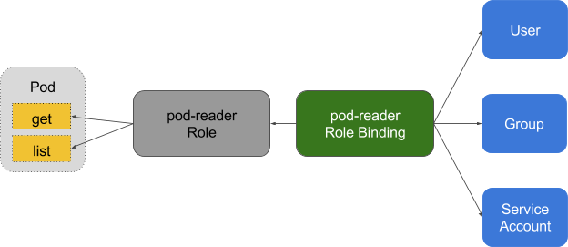

# RBAC

基于角色的访问控制机制（Role-Based Access Control，RBAC），在 RBAC 中，权限与角色相关联，用户通过成为适当角色的成员而得到这些角色的权限。这就极大地简化了权限的管理。
**使用 RBAC 可以很方便的更新访问授权策略而不用重启集群。**

从 Kubernetes 1.8 开始，RBAC 进入稳定版，其 API 为 `rbac.authorization.k8s.io/v1`。

在使用 RBAC 时，只需要在启动 `kube-apiserver` 时配置 `--authorization-mode=RBAC` 即可。

RBAC API 所定义的四种顶级类型。用户可以像使用其他 Kubernetes API 资源一样 （例如通过 `kubectl`、API 调用等）与这些资源进行交互。

在 RBAC 中定义了两个对象，用于描述在用户和资源之间的连接权限。

## Role 与 ClusterRole

`Role`（角色）是一系列权限的集合，例如一个角色可以包含读取 Pod 的权限和列出 Pod 的权限。**`Role` 只能用来给某个特定 namespace 中的资源作鉴权，对多 namespace 和集群级的资源或者
是非资源类的 API（如 `/healthz`）使用 `ClusterRole`**。

`ClusterRole` 对象可以授予与 `Role` 对象相同的权限，但由于它们属于集群范围对象，也可以使用它们授予对以下几种资源的访问权限：

- 集群范围资源（例如节点，即 `node`）
- 非资源类型 `endpoint`（例如 `/healthz`）
- 跨所有命名空间的命名空间范围资源（例如 `pod`，需要运行命令 `kubectl get pods --all-namespaces` 来查询集群中所有的 `pod`）

```yml
kind: Role
apiVersion: rbac.authorization.k8s.io/v1beta1
metadata:
  namespace: default
  name: pod-reader
rules:
- apiGroups: [""] # 空字符串""表明使用 core API group
  resources: ["pods"]
  verbs: ["get", "watch", "list"]
```

上面的例子描述了 ”default” 命名空间中的一个 `Role` 对象的定义，用于授予对 pod 的读访问权限。

```yml
kind: ClusterRole
apiVersion: rbac.authorization.k8s.io/v1beta1
metadata:
  # ClusterRole 是集群范围对象，所以不需要定义 "namespace" 字段
  name: secret-reader
rules:
- apiGroups: [""]
  resources: ["secrets"]
  verbs: ["get", "watch", "list"]
```
上面例子中的 `ClusterRole` 定义可用于授予用户对某一特定命名空间，或者所有命名空间中的 `secret`（取决于其绑定方式）的读访问权限

## RoleBinding 与 ClusterRoleBinding
`RoleBinding` 把 `Role` 或` ClusterRole` 中定义的各种权限映射到 `User`，`Service Account` 或者 `Group`，从而让这些用户继承角色在 namespace 中的权限。
`ClusterRoleBinding` 让用户继承 `ClusterRole` 在整个集群中的权限。



`RoleBinding` 可以引用在同一命名空间内定义的 `Role` 对象。
```yml
# 以下角色绑定定义将允许用户 "jane" 从 "default" 命名空间中读取 pod。
kind: RoleBinding
apiVersion: rbac.authorization.k8s.io/v1beta1
metadata:
  name: read-pods
  namespace: default
subjects:
- kind: User
  name: jane
  apiGroup: rbac.authorization.k8s.io
roleRef:
  kind: Role
  name: pod-reader
  apiGroup: rbac.authorization.k8s.io
```

`RoleBinding` 对象也可以引用一个 `ClusterRole` 对象用于在 `RoleBinding` 所在的命名空间内授予用户对所引用的 `ClusterRole` 中定义的命名空间资源的访问权限。
这一点允许管理员在整个集群范围内首先定义一组通用的角色，然后再在不同的命名空间中复用这些角色。

例如，尽管下面示例中的 `RoleBinding` 引用的是一个 `ClusterRole` 对象，但是用户 ”dave” （即角色绑定主体）还是只能读取 ”development” 命名空间中的
secret（即 `RoleBinding` 所在的命名空间）。
```yml
kind: RoleBinding
apiVersion: rbac.authorization.k8s.io/v1beta1
metadata:
  name: read-secrets
  namespace: development # 这里表明仅授权读取 "development" 命名空间中的资源。
subjects:
- kind: User
  name: dave
  apiGroup: rbac.authorization.k8s.io
roleRef:
  kind: ClusterRole
  name: secret-reader
  apiGroup: rbac.authorization.k8s.io
```

最后，可以使用 `ClusterRoleBinding` 在集群级别和所有命名空间中授予权限。下面示例中所定义的 `ClusterRoleBinding` 允许在用户组 ”manager” 中的任何用户都可以读取
集群中任何命名空间中的 secret。

```yml
kind: ClusterRoleBinding
apiVersion: rbac.authorization.k8s.io/v1beta1
metadata:
  name: read-secrets-global
subjects:
- kind: Group
  name: manager
  apiGroup: rbac.authorization.k8s.io
roleRef:
  kind: ClusterRole
  name: secret-reader
  apiGroup: rbac.authorization.k8s.io
```

## ClusterRole 聚合
从 v1.9 开始，在 `ClusterRole` 中可以通过 `aggregationRule` 来与其他 `ClusterRole` 聚合使用：
```yml
kind: ClusterRole
apiVersion: rbac.authorization.k8s.io/v1
metadata:
  name: monitoring
aggregationRule:
  clusterRoleSelectors:
  - matchLabels:
      rbac.example.com/aggregate-to-monitoring: "true"
rules: [] # Rules are automatically filled in by the controller manager.
---
kind: ClusterRole
apiVersion: rbac.authorization.k8s.io/v1
metadata:
  name: monitoring-endpoints
  labels:
    rbac.example.com/aggregate-to-monitoring: "true"
# These rules will be added to the "monitoring" role.
rules:
- apiGroups: [""]
  resources: ["services", "endpoints", "pods"]
  verbs: ["get", "list", "watch"]
```

## 对资源的引用
大多数资源由代表其名字的字符串表示，例如 ”pods”，就像它们出现在相关 API endpoint 的 URL 中一样。然而，有一些 Kubernetes API 还 包含了”子资源”，比如 `pod` 的 `logs`。
在 Kubernetes 中，`pod logs endpoint` 的 URL 格式为：
```
GET /api/v1/namespaces/{namespace}/pods/{name}/log
```

”pods” 是命名空间资源，而 ”log” 是 pods 的子资源。为了在 RBAC `Role` 中表示出这一点，我们需要使用斜线来划分资源与子资源。
如果需要 `Role` 绑定主体读取 `pods` 以及 `pods log`（如果不显示指定子资源，那么子资源是没有权限访问的），需要定义以下 `Role`：
```yml
kind: Role
apiVersion: rbac.authorization.k8s.io/v1beta1
metadata:
  namespace: default
  name: pod-and-pod-logs-reader
rules:
- apiGroups: [""]
  resources: ["pods", "pods/log"]
  verbs: ["get", "list"]
```

通过 `resourceNames` 列表，`Role`可以针对不同种类的请求根据**资源名**引用资源实例。当**指定了 `resourceNames` 列表时，不同动作种类的请求的权限，
如使用 ”get”、”delete”、”update” 以及 ”patch” 等动词的请求，将被限定到资源列表中所包含的资源实例上**。 例如，如果需要限定一个角色绑定主体
只能 ”get” 或者 ”update” 一个名为 "my-configmap" 的 `configmap` 时，可以定义以下角色：

```yml
kind: Role
apiVersion: rbac.authorization.k8s.io/v1beta1
metadata:
  namespace: default
  name: configmap-updater
rules:
- apiGroups: [""]
  resources: ["configmap"]
  resourceNames: ["my-configmap"]
  verbs: ["update", "get"]
```

## 角色定义的例子
使用 `kubectl api-resources` 查看所有 kubernetes 资源对象所属的 `apiGroups`：
```sh
$ kubectl api-resources
NAME                              SHORTNAMES   APIGROUP                       NAMESPACED   KIND
bindings                                                                      true         Binding
componentstatuses                 cs                                          false        ComponentStatus
configmaps                        cm                                          true         ConfigMap
endpoints                         ep                                          true         Endpoints
events                            ev                                          true         Event
limitranges                       limits                                      true         LimitRange
namespaces                        ns                                          false        Namespace
nodes                             no                                          false        Node
persistentvolumeclaims            pvc                                         true         PersistentVolumeClaim
persistentvolumes                 pv                                          false        PersistentVolume
pods                              po                                          true         Pod
podtemplates                                                                  true         PodTemplate
replicationcontrollers            rc                                          true         ReplicationController
resourcequotas                    quota                                       true         ResourceQuota
secrets                                                                       true         Secret
serviceaccounts                   sa                                          true         ServiceAccount
services                          svc                                         true         Service
mutatingwebhookconfigurations                  admissionregistration.k8s.io   false        MutatingWebhookConfiguration
validatingwebhookconfigurations                admissionregistration.k8s.io   false        ValidatingWebhookConfiguration
customresourcedefinitions         crd,crds     apiextensions.k8s.io           false        CustomResourceDefinition
apiservices                                    apiregistration.k8s.io         false        APIService
controllerrevisions                            apps                           true         ControllerRevision
daemonsets                        ds           apps                           true         DaemonSet
deployments                       deploy       apps                           true         Deployment
...
```

如果 `apiGroups: [""]` 则表示 core API Group。

允许读取 core API Group 中定义的资源 ”pods”：

```yml
rules:
- apiGroups: [""]
  resources: ["pods"]
  verbs: ["get", "list", "watch"]
```

允许读写在 ”extensions” 和 ”apps” API Group 中定义的 ”deployments”：
```yml
rules:
- apiGroups: ["extensions", "apps"]
  resources: ["deployments"]
  verbs: ["get", "list", "watch", "create", "update", "patch", "delete"]
```

允许读取 ”pods” 以及读写 ”jobs”：
```yml
rules:
- apiGroups: [""]
  resources: ["pods"]
  verbs: ["get", "list", "watch"]
- apiGroups: ["batch", "extensions"]
  resources: ["jobs"]
  verbs: ["get", "list", "watch", "create", "update", "patch", "delete"]
```

允许读取一个名为 ”my-config” 的 ConfigMap 实例（需要将其通过 `RoleBinding` 绑定从而限制针对某一个命名空间中定义的一个 `ConfigMap` 实例的访问）：
```yml
rules:
- apiGroups: [""]
  resources: ["configmaps"]
  resourceNames: ["my-config"]
  verbs: ["get"]
```

允许读取 core API Group 中的 ”nodes” 资源（由于 **Node 是集群级别资源，所以此 `ClusterRole` 定义需要与一个 `ClusterRoleBinding` 绑定才能有效**）：
```yml
rules:
- apiGroups: [""]
  resources: ["nodes"]
  verbs: ["get", "list", "watch"]
```

允许对非资源 endpoint `/healthz` 及其所有子路径的 `GET` 和 `POST` 请求（此 `ClusterRole` 定义需要与一个 `ClusterRoleBinding` 绑定才能有效）：
```yml
rules:
- nonResourceURLs: ["/healthz", "/healthz/*"] # 在非资源 URL 中，'*' 代表后缀通配符
  verbs: ["get", "post"]
```

## 角色绑定主体
`RoleBinding` 或者 `ClusterRoleBinding` 将 `Role` 绑定到角色绑定主体（`Subject`）。 角色绑定主体可以是用户组（`Group`）、用户（`User`）或者服务账户（`Service Accounts`）。

用户由字符串表示。可以是纯粹的用户名，例如 ”alice”、电子邮件风格的名字，如 `bob@example.com` 或者是用字符串表示的数字id。由 Kubernetes 管理员配置
[认证模块](https://k8smeetup.github.io/docs/admin/authentication/)以产生所需格式的用户名。对于用户名，RBAC 授权系统不要求任何特定的格式。然而，
前缀 **`system:` 是为 Kubernetes 系统使用而保留的**，所以管理员应该确保用户名不会意外地包含这个前缀。

Kubernetes 中的用户组信息由授权模块提供。用户组与用户一样由字符串表示。Kubernetes 对用户组字符串没有格式要求，但前缀 `system:` 同样是被系统保留的。

**在认证时，ServiceAccount 的用户名格式为 `system:serviceaccount:(NAMESPACE):(SERVICEACCOUNT)`，并从属于两个 `group：system:serviceaccounts`
 和 `system:serviceaccounts:(NAMESPACE)`**。

### 角色绑定的一些例子
以下示例中，仅截取展示了 `RoleBinding` 的 `subjects` 字段。

一个名为 `alice@example.com` 的用户：
```yml
subjects:
- kind: User
  name: "alice@example.com"
  apiGroup: rbac.authorization.k8s.io
```

一个名为 `frontend-admins` 的用户组：
```yml
subjects:
- kind: Group
  name: "frontend-admins"
  apiGroup: rbac.authorization.k8s.io
```

`kube-system` 命名空间中的默认服务账户：
```yml
subjects:
- kind: ServiceAccount
  name: default
  namespace: kube-system
```

名为 `qa` 命名空间中的所有服务账户：
```yml
subjects:
- kind: Group
  name: system:serviceaccounts:qa
  apiGroup: rbac.authorization.k8s.io
```

在集群中的所有服务账户：
```yml
subjects:
- kind: Group
  name: system:serviceaccounts
  apiGroup: rbac.authorization.k8s.io
```

所有认证过的用户（version 1.5+）：
```yml
subjects:
- kind: Group
  name: system:authenticated
  apiGroup: rbac.authorization.k8s.io
```

所有未认证的用户（version 1.5+）：
```yml
subjects:
- kind: Group
  name: system:unauthenticated
  apiGroup: rbac.authorization.k8s.io
```

所有用户（version 1.5+）：
```yml
subjects:
- kind: Group
  name: system:authenticated
  apiGroup: rbac.authorization.k8s.io
- kind: Group
  name: system:unauthenticated
  apiGroup: rbac.authorization.k8s.io
```

## 默认角色与默认角色绑定
RBAC 现在被 Kubernetes 深度集成， API Server 会创建一组默认的 `ClusterRole` 和 `ClusterRoleBinding` 对象。 这些默认对象中有许多包含 `system:` 前缀，表明这些资源由 Kubernetes 基础组件”拥有”。
对这些资源的修改可能导致非功能性集群（non-functional cluster）。一个例子是 `system:node` `ClusterRole`对象。这个 `ClusterRole` 定义了 `kubelets` 的权限。如果这个角色被修改，
可能会导致 `kubelets` 无法正常工作。

所有默认的 `ClusterRole` 和 `ClusterRoleBinding` 对象都会被标记为 `kubernetes.io/bootstrapping=rbac-defaults`。

使用 `kubectl get clusterroles --namespace=kube-system` 查看 `ClusterRole`。

其他的内置角色可以参考 [default-roles-and-role-bindings](https://kubernetes.io/docs/reference/access-authn-authz/rbac/#default-roles-and-role-bindings)。
### 面向用户的角色
一些默认角色并不包含 `system:` 前缀，它们是面向用户的角色。

```yml
apiVersion: rbac.authorization.k8s.io/v1
kind: ClusterRoleBinding
metadata:
  name: cdf-deployer:cluster-admin
roleRef:
  apiGroup: rbac.authorization.k8s.io
  kind: ClusterRole
  name: cluster-admin
subjects:
- kind: ServiceAccount
  name: cdf-deployer
  namespace: kube-system
---
apiVersion: rbac.authorization.k8s.io/v1
kind: ClusterRoleBinding
metadata:
  name: heapster:apiserver
roleRef:
  apiGroup: rbac.authorization.k8s.io
  kind: ClusterRole
  name: system:heapster
subjects:
- kind: ServiceAccount
  name: heapster-apiserver
  namespace: kube-system
---
apiVersion: rbac.authorization.k8s.io/v1
kind: ClusterRoleBinding
metadata:
  name: cdf:view
roleRef:
  apiGroup: rbac.authorization.k8s.io
  kind: ClusterRole
  name: view
subjects:
- kind: ServiceAccount
  name: cdf-view
  namespace: kube-system
---
apiVersion: rbac.authorization.k8s.io/v1
kind: ClusterRoleBinding
metadata:
  name: suite-installer:admin
roleRef:
  apiGroup: rbac.authorization.k8s.io
  kind: ClusterRole
  name: admin
subjects:
- kind: ServiceAccount
  name: suite-installer
  namespace: kube-system
```

上面的例子，`core` 命名空间下名为 `cdf-deployer` 的 ServiceAccount 被绑定到了默认的 `ClusterRole` `cluster-admin` 上。
`kube-system` 命名空间下名为 `heapster-apiserver` 的 ServiceAccount 被绑定到了默认的 `ClusterRole` `system:heapster` 上。

面向用户的角色：
- `cluster-admin`，超级用户权限，允许对任何资源执行任何操作。
- `admin`，允许针对命名空间内大部分资源的读写访问，包括在命名空间内创建角色与角色绑定的能力。但不允许对资源配额（resource quota）或者命名空间本身的写访问。
- `edit`，允许对某一个命名空间内大部分对象的读写访问，但**不允许查看或者修改角色或者角色绑定**。
- `view`，允许对某一个命名空间内大部分对象的只读访问。**不允许查看角色或者角色绑定。 由于可扩散性等原因，不允许查看 secret 资源**。

## Permissive RBAC
所谓 Permissive RBAC 是指授权给所有的 Service Accounts 管理员权限。**不推荐的配置**。

```sh
kubectl create clusterrolebinding permissive-binding \
  --clusterrole=cluster-admin \
  --user=admin \
  --user=kubelet \
  --group=system:serviceaccounts
```
