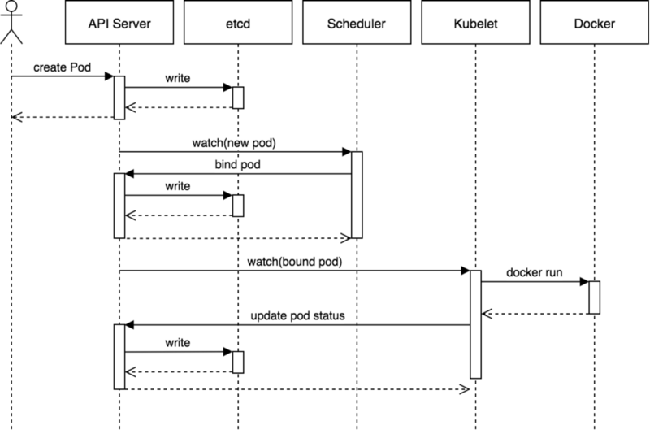

# Kubernetes 核心组件

Kubernetes 主要由以下几个核心组件组成：

- `etcd` 保存了整个集群的状态；
- `apiserver` 提供了资源操作的唯一入口，并提供认证、授权、访问控制、API 注册和发现等机制；
- `controller manager` 负责维护集群的状态，比如故障检测、自动扩展、滚动更新等；
- `scheduler` 负责资源的调度，按照预定的调度策略将 Pod 调度到相应的机器上；
- `kubelet` 负责维护容器的生命周期，同时也负责 Volume（CVI）和网络（CNI）的管理；
- Container runtime 负责镜像管理以及 Pod 和容器的真正运行（CRI）；
- `kube-proxy` 负责为 Service 提供 cluster 内部的服务发现和负载均衡

除了核心组件，还有一些推荐的 Add-ons：

- CoreDNS 负责为整个集群提供DNS服务（也可以使用 `kube-dns`，更推荐使用 CoreDNS）
- Ingress Controller 为服务提供外网入口
- Prometheus 提供资源监控 （Heapster 不建议使用，将被弃用）
- Dashboard 提供 GUI
- Federation 提供跨可用区的集群
- Fluentd-elasticsearch 提供集群日志采集、存储与查询

## 组件通信
多组件之间的通信原理为：
- `apiserver` 负责操作 `etcd`，且只有 `apiserver` 才直接操作 `etcd` 集群
- `apiserver` 对内（集群中的其他组件）和对外（用户）提供统一的 REST API，其他组件均通过 `apiserver` 进行通信
  - controller manager、`scheduler`、`kube-proxy` 和 `kubelet` 等均通过 apiserver watch API 监测资源变化情况，并对资源作相应的操作
  - 所有需要更新资源状态的操作均通过 `apiserver` 的 REST API 进行
- `apiserver` 也会直接调用 `kubelet` API（如 `logs`, `exec`, `attach` 等），默认不校验 `kubelet` 证书，但可以通过 `--kubelet-certificate-authority`
开启（而 GKE 通过 SSH 隧道保护它们之间的通信）

典型的创建 Pod 的流程为：

## 端口号

