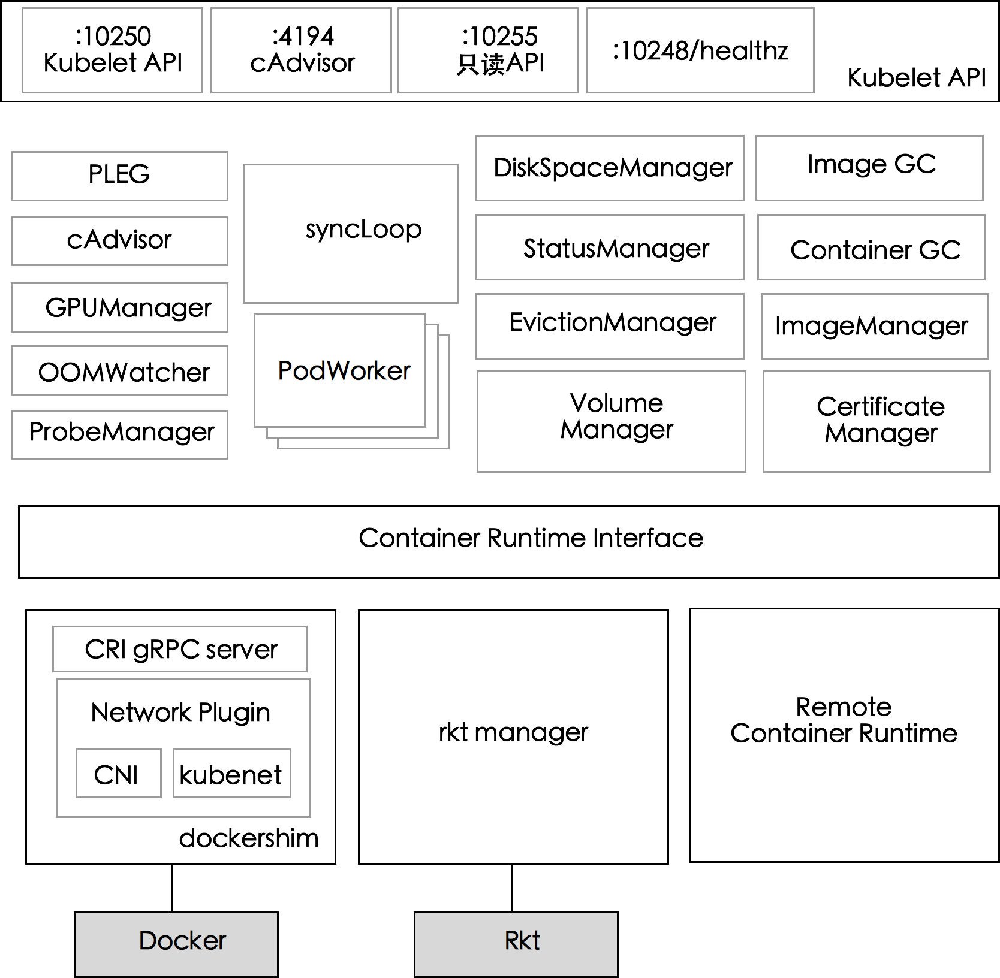
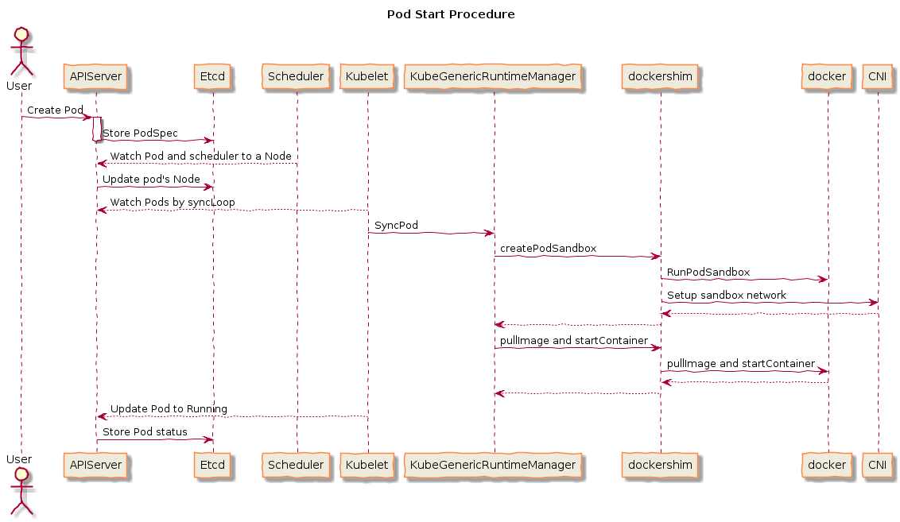

# kubelet
每个节点上都运行一个 `kubelet` 服务进程，默认监听 `10250` 端口，接收并执行 master 发来的指令，管理 Pod 及 Pod 中的容器。每个 `kubelet` 进程会在 API Server 上注册节点
自身信息，定期向 master 节点汇报节点的资源使用情况，并通过 cAdvisor 监控节点和容器的资源。

## 节点管理
节点管理主要是节点自注册和节点状态更新：
- Kubelet 可以通过设置启动参数 `--register-node` 来确定是否向 API Server 注册自己；如果 Kubelet 没有选择自注册模式，则需要用户自己配置 Node 资源信息，
同时需要告知 Kubelet 集群上的 API Server 的位置（`--api-servers` 参数）；
- Kubelet 在启动时通过 API Server 注册节点信息，并定时向 API Server 发送节点新消息，API Server 在接收到新消息后，将信息写入 etcd。

## Pod 管理

kubelet 以 `PodSpec` 为单位来运行任务，`PodSpec` 是一个描述 pod 的 YAML 或 JSON 对象。 kubelet 运行多种机制（主要通过 apiserver）提供的一组 `PodSpec`，并
确保这些 `PodSpecs` 中描述的容器健康运行。不是 Kubernetes 创建的容器将不在 kubelet 的管理范围。

除了来自 apiserver 的 `PodSpec` 之外，还有三种方法可以将容器清单提供给 Kubelet：
- 文件：启动参数 `--pod-manifest-path` 设置的文件路径。kubelet 将定期监听该路径下的文件以获得更新。监视周期默认为 20 秒，可通过参数进行配置。
默认 `/etc/kubernetes/manifests/`。
- HTTP endpoint (URL)：启动参数 `--manifest-url` 设置。每 20 秒检查一次该端点（该时间间隔也是可以通过命令行配置的）。
- HTTP server：kubelet 还可以监听 HTTP 并响应简单的 API（当前未指定）以提交新的清单。

**前面有几个示例如 `kube-apiserver`，`kube-controller-manager`，`kube-scheduler` 都是提供给了 pod 的 template，这是因为这几个 pods 都是交给了 kubelet 来管理。**
下面的示例中 `--pod-manifest-path={K8S_HOME}/runconf` 表示监听 `{K8S_HOME}/runconf` 目录下的文件变化，`kube-apiserver` 等几个 pod 的 yaml 文件就放在该目录下。

### 通过 API Server 获取 Pod 清单及创建 Pod 的过程

### Static Pod
以非 API Server 方式创建的 Pod 都叫 Static Pod。Kubelet 将 Static Pod 的状态汇报给 API Server，API Server 为该 Static Pod 创建一个 Mirror Pod 和
其相匹配。Mirror Pod 的状态将真实反映 Static Pod 的状态。当 Static Pod 被删除时，与之相对应的 Mirror Pod 也会被删除。

## 容器健康检查
Pod 通过两类探针检查容器的健康状态，参考 [Pod 探针](../pod/lifecycle.html#探针)。

kubelet 会定时调用健康探针来诊断容器的状态。

## cAdvisor 资源监控

Kubernetes 集群中，**应用程序的执行情况可以在不同的级别上监测到，这些级别包括：容器、Pod、Service 和整个集群**。Heapster 项目为 Kubernetes 提供了一个基本的监控平台，
它是集群级别的监控和事件数据集成器 (Aggregator)。Heapster 以 Pod 的方式运行在集群中，Heapster 通过 Kubelet 发现所有运行在集群中的节点，并查看来自这
些节点的资源使用情况。Kubelet 通过 cAdvisor 获取其所在节点及容器的数据。Heapster 通过带着关联标签的 Pod 分组这些信息，这些数据将被推到一个可配置的后端，
用于存储和可视化展示。支持的后端包括 InfluxDB (使用 Grafana 实现可视化) 和 Google Cloud Monitoring。

- cAdvisor 是一个开源的分析容器资源使用率和性能特性的代理工具，已集成到 Kubernetes 代码中。
- cAdvisor 自动查找所有在其所在节点上的容器，自动采集 CPU、内存、文件系统和网络使用的统计信息。
- cAdvisor 通过它所在节点机的 Root 容器，采集并分析该节点机的全面使用情况。
- cAdvisor 通过其所在节点机的 `4194` 端口暴露一个简单的 UI。

## Kubelet Eviction（驱逐）

Kubelet 会监控资源的使用情况，并使用驱逐机制防止计算和存储资源耗尽。在驱逐时，Kubelet 将 Pod 的所有容器停止，并将 `PodPhase` 设置为 `Failed`。

Kubelet 定期（`housekeeping-interval`）检查系统的资源是否达到了预先配置的驱逐阈值，包括：

| Eviction Signal | Condition | Description |
| --- | --- | --- |
| `memory.available` | `MemoryPressue` | `memory.available := node.status.capacity[memory] - node.stats.memory.workingSet` |
| `nodefs.available` | `DiskPressure`| `nodefs.available := node.stats.fs.available`（Kubelet Volume 以及日志等） |
| `nodefs.inodesFree` | `DiskPressure` | `nodefs.inodesFree := node.stats.fs.inodesFree` |
| `imagefs.available` | `DiskPressure` | `imagefs.available := node.stats.runtime.imagefs.available`（镜像以及容器可写层等） |
| `imagefs.inodesFree` | `DiskPressure` | `imagefs.inodesFree := node.stats.runtime.imagefs.inodesFree` |


这些驱逐阈值可以使用百分比，也可以使用绝对值，如
```sh
--eviction-hard=memory.available<500Mi,nodefs.available<1Gi,imagefs.available<100Gi
--eviction-minimum-reclaim="memory.available=0Mi,nodefs.available=500Mi,imagefs.available=2Gi"`
--system-reserved=memory=1.5Gi
```

这些驱逐信号可以分为软驱逐和硬驱逐：
- 软驱逐（Soft Eviction）：配合驱逐宽限期（`eviction-soft-grace-period` 和 `eviction-max-pod-grace-period` ）一起使用。系统资源达到软驱逐阈值并在超过
宽限期之后才会执行驱逐动作。
- 硬驱逐（Hard Eviction）：系统资源达到硬驱逐阈值时立即执行驱逐动作。

驱逐动作包括回收节点资源和驱逐用户 Pod 两种：
- 回收节点资源
  - 配置了 `imagefs` 阈值时
    - 达到 `nodefs` 阈值：删除已停止的 Pod
    - 达到 `imagefs` 阈值：删除未使用的镜像
  - 未配置 `imagefs` 阈值时
    - 达到 `nodefs` 阈值时，按照删除已停止的 Pod 和删除未使用镜像的顺序清理资源
- 驱逐用户 Pod
  - 驱逐顺序为：`BestEffort`、`Burstable`、`Guaranteed`
  - 配置了 `imagefs` 阈值时
    - 达到 `nodefs` 阈值，基于 `nodefs` 用量驱逐（local volume + logs）
    - 达到 `imagefs` 阈值，基于 `imagefs` 用量驱逐（容器可写层）
  - 未配置 `imagefs` 阈值时
    - 达到 `nodefs` 阈值时，按照总磁盘使用驱逐（local volume + logs + 容器可写层）

## 容器运行时
容器运行时（Container Runtime）是 Kubernetes 最重要的组件之一，负责真正管理镜像和容器的生命周期。Kubelet 通
过 [Container Runtime Interface (CRI)](../extension/cri.html) 与容器运行时交互，以管理镜像和容器。

Container Runtime Interface（CRI）是 Kubernetes v1.5 引入的容器运行时接口，它将 Kubelet 与容器运行时解耦，将原来完全面向 Pod 级别的内
部接口拆分成面向 Sandbox 和 Container 的 gRPC 接口，并将镜像管理和容器管理分离到不同的服务。


CRI 基于 gRPC 定义了 `RuntimeService` 和 `ImageService` 等两个 gRPC 服务，分别用于容器运行时和镜像的管理。

**Kubelet 作为 CRI 的客户端，而容器运行时则需要实现 CRI 的服务端**（即 gRPC server，通常称为 **CRI shim**）。容器运行时在启动 gRPC server 时需要监听在
本地的 Unix Socket （Windows 使用 tcp 格式）。

目前基于 CRI 容器引擎已经比较丰富了，包括：
- Docker: 核心代码依然保留在 kubelet 内部（[pkg/kubelet/dockershim](https://github.com/kubernetes/kubernetes/tree/master/pkg/kubelet/dockershim)），
是最稳定和特性支持最好的运行时
- OCI 容器运行时：
  - 社区有两个实现
    - [Containerd](https://github.com/containerd/cri)，支持 kubernetes v1.7+
    - [CRI-O](https://github.com/cri-o/cri-o)，支持 Kubernetes v1.6+
  - 支持的 OCI 容器引擎包括
    - [runc](https://github.com/opencontainers/runc)：OCI 标准容器引擎
    - [gVisor](https://github.com/google/gvisor)：谷歌开源的基于用户空间内核的沙箱容器引擎
    - [Clear Containers](https://github.com/clearcontainers/runtime)：Intel 开源的基于虚拟化的容器引擎
    - [Kata Containers](https://github.com/kata-containers/runtime)：基于虚拟化的容器引擎，由 Clear Containers 和 runV 合并而来
- [PouchContainer](https://github.com/alibaba/pouch)：阿里巴巴开源的胖容器引擎
- [Frakti](https://github.com/kubernetes/frakti)：支持 Kubernetes v1.6+，提供基于 hypervisor 和 docker 的混合运行时，适用于运行非可信应用，如多租户和 NFV 等场景
- [Rktlet](https://github.com/kubernetes-incubator/rktlet)：支持 rkt 容器引擎
- [Virtlet](https://github.com/Mirantis/virtlet)：Mirantis 开源的虚拟机容器引擎，直接管理 libvirt 虚拟机，镜像须是 qcow2 格式
- [Infranetes](https://github.com/apporbit/infranetes)：直接管理 IaaS 平台虚拟机，如 GCE、AWS 等

## kubelet systemd 文件示例
```
[Unit]
Description=Kubernetes Kubelet
Documentation=https://github.com/GoogleCloudPlatform/kubernetes
After=docker.service
Wants=docker.service

[Service]
TimeoutStartSec=300s
WorkingDirectory={KUBELET_HOME}/kubelet
ExecStart=/usr/bin/kubelet \
  --allow-privileged=true \
  --root-dir={KUBELET_HOME}/kubelet \
  --cert-dir={KUBELET_HOME}/kubelet/pki \
  --authentication-token-webhook \
  --read-only-port=0 \
  --anonymous-auth=false \
  --client-ca-file={K8S_HOME}/ssl/ca.crt \
  --cluster-dns={DNS_SVC_IP} \
  --cluster-domain=cluster.local. \
  --network-plugin=cni \
  --cni-bin-dir={K8S_HOME}/cni \
  --cni-conf-dir={K8S_HOME}/cni/conf \
  --kubeconfig={K8S_HOME}/ssl/native.kubeconfig \
  --hostname-override={THIS_NODE} \
  --pod-manifest-path={K8S_HOME}/runconf \
  --node-labels={NODE_LABELS} \
  --hairpin-mode=hairpin-veth \
  --fail-swap-on={FAIL_SWAP_ON} \
  --system-reserved=memory=1.5Gi \
  --v=1 \
  --logtostderr=true \
  --runtime-cgroups=/systemd/system.slice \
  --kubelet-cgroups=/systemd/system.slice \
  --tls-cipher-suites=TLS_ECDHE_RSA_WITH_AES_256_GCM_SHA384,TLS_ECDHE_RSA_WITH_AES_128_GCM_SHA256,TLS_ECDHE_RSA_WITH_AES_256_CBC_SHA,TLS_ECDHE_RSA_WITH_AES_128_CBC_SHA,TLS_RSA_WITH_AES_256_GCM_SHA384,TLS_RSA_WITH_AES_128_GCM_SHA256,TLS_RSA_WITH_AES_256_CBC_SHA,TLS_RSA_WITH_AES_128_CBC_SHA
Restart=always
RestartSec=5
User=root

[Install]
WantedBy=multi-user.target
```

`native.kubeconfig` 如下：
```
apiVersion: v1
kind: Config
clusters:
  - cluster:
      certificate-authority: /opt/kubernetes/ssl/ca.crt
      server: https://shccentos72vm07.hpeswlab.net:8443
    name: kubernetes
contexts:
  - context:
      cluster: kubernetes
      user: kubelet
    name: kubelet-to-kubernetes
current-context: kubelet-to-kubernetes
users:
  - name: kubelet
    user:
      client-certificate: /opt/kubernetes/ssl/kubernetes.crt
      client-key: /opt/kubernetes/ssl/kubernetes.key
```

## kubelet 工作原理
Kubelet 由许多内部组件构成：
- Kubelet API，包括 `10250` 端口的认证 API、`4194` 端口的 cAdvisor API、`10255` 端口的只读 API 以及 `10248` 端口的健康检查 API
- syncLoop：从 API 或者 manifest 目录接收 Pod 更新，发送到 podWorkers 处理，大量使用 channel 处理来处理异步请求
- 辅助的 manager，如 cAdvisor、PLEG、Volume Manager 等，处理 syncLoop 以外的其他工作
- CRI：**容器执行引擎接口，负责与 container runtime shim 通信**
- 容器执行引擎，如 dockershim、rkt 等（注：rkt 暂未完成 CRI 的迁移）
- 网络插件，目前支持 CNI 和 kubenet

在 Kubernetes 项目中，kubelet 主要负责同容器运行时（比如 Docker 项目）打交道。而这个交互所依赖的，是一个称作 CRI（Container Runtime Interface）的远程调用接口，这个接口定义了容器运行时的各项核心操作，比如：启动一个容器需要的所有参数。

这也是为何，Kubernetes 项目并不关心你部署的是什么容器运行时、使用的什么技术实现，只要你的这个容器运行时能够运行标准的容器镜像，它就可以通过实现 CRI 接入到 Kubernetes 项目当中。

而具体的容器运行时，比如 Docker 项目，则一般通过 OCI 这个容器运行时规范同底层的 Linux 操作系统进行交互，即：把 CRI 请求翻译成对 Linux 操作系统的调用（操作 Linux Namespace 和 Cgroups 等）。

此外，kubelet 还通过 gRPC 协议同一个叫作 Device Plugin 的插件进行交互。这个插件，是 Kubernetes 项目用来管理 GPU 等宿主机物理设备的主要组件，也是基于 Kubernetes 项目进行机器学习训练、高性能作业支持等工作必须关注的功能。

而kubelet 的另一个重要功能，则是调用网络插件和存储插件为容器配置网络和持久化存储。这两个插件与 kubelet 进行交互的接口，分别是 CNI（Container Networking Interface）和 CSI（Container Storage Interface）。



### Pod 启动流程

