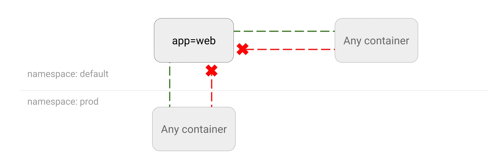
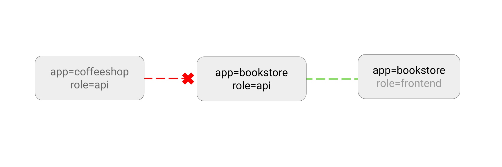
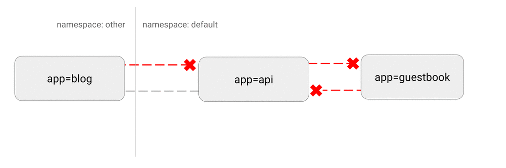
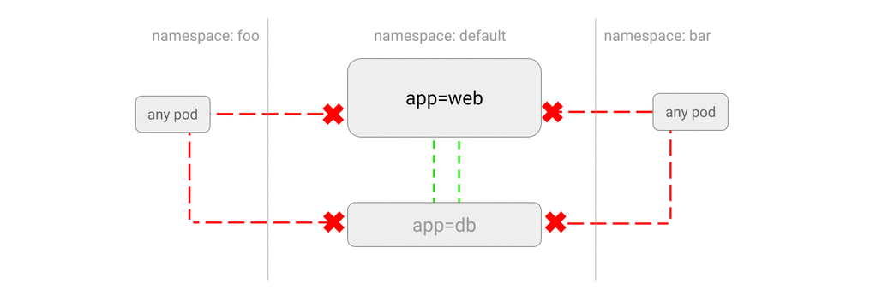
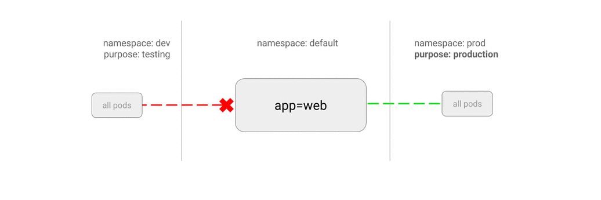
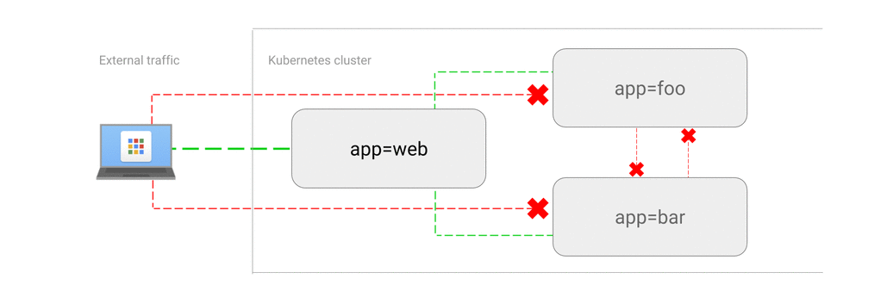

# NetworkPolicy

在 Kubernetes 里，网络隔离能力的定义，是依靠一种专门的 API 对象来描述的，即：NetworkPolicy。

Kubernetes 里的 **Pod 默认都是“允许所有”（Accept All）的，即：Pod 可以接收来自任何发送方的请求；或者，向任何接收方发送请求。而如果你要对这个情况作出限制，就必须通过 NetworkPolicy 对象来指定**。


```yaml
apiVersion: networking.k8s.io/v1
kind: NetworkPolicy
metadata:
  name: test-network-policy
  namespace: default
spec:
  podSelector:
    matchLabels:
      role: db
  policyTypes:
  - Ingress
  - Egress
  ingress:
  - from:
    - ipBlock:
        cidr: 172.17.0.0/16
        except:
        - 172.17.1.0/24
    - namespaceSelector:
        matchLabels:
          project: myproject
    - podSelector:
        matchLabels:
          role: frontend
    ports:
    - protocol: TCP
      port: 6379
  egress:
  - to:
    - ipBlock:
        cidr: 10.0.0.0/24
    ports:
    - protocol: TCP
      port: 5978
```


而在上面这个例子里，你首先会看到 podSelector 字段。它的作用，就是**定义这个 NetworkPolicy 的限制范围**，比如：当前 Namespace 里携带了 role=db 标签的 Pod。


如果你把 podSelector 字段留空：

```yaml
spec:
 podSelector: {}
```

**那么这个 NetworkPolicy 就会作用于当前 Namespace 下的所有 Pod**。

而一旦 Pod 被 NetworkPolicy 选中，那么这个 Pod 就会进入“拒绝所有”（Deny All）的状态，即：这个 Pod 既不允许被外界访问，也不允许对外界发起访问。

**而 NetworkPolicy 定义的规则，其实就是“白名单”**。


例如，在我们上面这个例子里，我在 policyTypes 字段，定义了这个 NetworkPolicy 的类型是 ingress 和 egress，即：它既会影响流入（ingress）请求，也会影响流出（egress）请求。

然后，在 ingress 字段里，我定义了 from 和 ports，即：允许流入的“白名单”和端口。其中，这个允许流入的“白名单”里，我指定了三种并列的情况，分别是：ipBlock、namespaceSelector 和 podSelector。

而在 egress 字段里，我则定义了 to 和 ports，即：允许流出的“白名单”和端口。这里允许流出的“白名单”的定义方法与 ingress 类似。只不过，这一次 ipblock 字段指定的，是目的地址的网段。

综上所述，这个 NetworkPolicy 对象，指定的隔离规则如下所示：

该隔离规则只对 default Namespace 下的，携带了 role=db 标签的 Pod 有效。限制的请求类型包括 ingress（流入）和 egress（流出）。

Kubernetes 会拒绝任何访问被隔离 Pod 的请求，除非这个请求来自于以下“白名单”里的对象，并且访问的是被隔离 Pod 的 6379 端口。这些“白名单”对象包括：

default Namespace 里的，携带了 role=fronted 标签的 Pod；

任何 Namespace 里的、携带了 project=myproject 标签的 Pod；

任何源地址属于 172.17.0.0/16 网段，且不属于 172.17.1.0/24 网段的请求。

Kubernetes 会拒绝被隔离 Pod 对外发起任何请求，除非请求的目的地址属于 10.0.0.0/24 网段，并且访问的是该网段地址的 5978 端口。

Kubernetes 在 1.3 引入了 Network Policy，Network Policy 提供了基于策略的网络控制，用于隔离应用并减少攻击面。它使
用标签选择器模拟传统的分段网络，并通过策略控制它们之间的流量以及来自外部的流量。

Network Policy 需要网络插件来监测这些策略和 Pod 的变更，并为 Pod 配置流量控制。


使用 Network Policy 时，需要注意
- v1.6 以及以前的版本需要在 `kube-apiserver` 中开启 `extensions/v1beta1/networkpolicies`
- 网络插件要支持 Network Policy，支持 Network Policy 的网络插件：
  - Calico
  - Romana
  - Weave Net
  - Trireme
  - OpenContrail


## 简单示例
以 calico 为例：
```sh
kubelet --network-plugin=cni --cni-conf-dir=/etc/cni/net.d --cni-bin-dir=/opt/cni/bin ...
```

安装 calio 网络插件：
```sh
# 注意修改 CIDR，需要跟 k8s pod-network-cidr 一致，默认为 192.168.0.0/16
kubectl apply -f https://docs.projectcalico.org/v3.0/getting-started/kubernetes/installation/hosted/kubeadm/1.7/calico.yaml
```

部署一个 nginx 服务：
```sh
$ kubectl run nginx --image=nginx --replicas=2
deployment "nginx" created
$ kubectl expose deployment nginx --port=80
service "nginx" exposed
```

此时，通过其他 Pod 是可以访问 nginx 服务的：
```sh
$ kubectl get svc,pod
NAME                        CLUSTER-IP    EXTERNAL-IP   PORT(S)    AGE
svc/kubernetes              10.100.0.1    <none>        443/TCP    46m
svc/nginx                   10.100.0.16   <none>        80/TCP     33s

NAME                        READY         STATUS        RESTARTS   AGE
po/nginx-701339712-e0qfq    1/1           Running       0          35s
po/nginx-701339712-o00ef    1/1           Running       0

$ kubectl run busybox --rm -ti --image=busybox /bin/sh
Waiting for pod default/busybox-472357175-y0m47 to be running, status is Pending, pod ready: false

Hit enter for command prompt

/ # wget --spider --timeout=1 nginx
Connecting to nginx (10.100.0.16:80)
```

开启 `default` namespace 的 DefaultDeny Network Policy 后，其他 Pod（包括 namespace 外部）不能访问 nginx 了：
```sh
$ cat default-deny.yaml
apiVersion: networking.k8s.io/v1
kind: NetworkPolicy
metadata:
  name: default-deny
spec:
  podSelector: {}
  policyTypes:
  - Ingress

$ kubectl create -f default-deny.yaml

$ kubectl run busybox --rm -ti --image=busybox /bin/sh
Waiting for pod default/busybox-472357175-y0m47 to be running, status is Pending, pod ready: false

Hit enter for command prompt

/ # wget --spider --timeout=1 nginx
Connecting to nginx (10.100.0.16:80)
wget: download timed out
/ #
```

最后再创建一个运行带有 `access=true` 的 Pod 访问的网络策略：
```sh
$ cat nginx-policy.yaml
kind: NetworkPolicy
apiVersion: networking.k8s.io/v1
metadata:
  name: access-nginx
spec:
  podSelector:
    matchLabels:
      run: nginx
  ingress:
  - from:
    - podSelector:
        matchLabels:
          access: "true"

$ kubectl create -f nginx-policy.yaml
networkpolicy "access-nginx" created

# 不带 access=true 标签的 Pod 还是无法访问 nginx 服务
$ kubectl run busybox --rm -ti --image=busybox /bin/sh
Waiting for pod default/busybox-472357175-y0m47 to be running, status is Pending, pod ready: false

Hit enter for command prompt

/ # wget --spider --timeout=1 nginx
Connecting to nginx (10.100.0.16:80)
wget: download timed out
/ #


# 而带有 access=true 标签的 Pod 可以访问 nginx 服务
$ kubectl run busybox --rm -ti --labels="access=true" --image=busybox /bin/sh
Waiting for pod default/busybox-472357175-y0m47 to be running, status is Pending, pod ready: false

Hit enter for command prompt

/ # wget --spider --timeout=1 nginx
Connecting to nginx (10.100.0.16:80)
/ #
```

最后开启 nginx 服务的外部访问：
```sh
$ cat nginx-external-policy.yaml
apiVersion: networking.k8s.io/v1
kind: NetworkPolicy
metadata:
  name: front-end-access
  namespace: sock-shop
spec:
  podSelector:
    matchLabels:
      run: nginx
  ingress:
    - ports:
        - protocol: TCP
          port: 80

$ kubectl create -f nginx-external-policy.yaml
```

## 使用场景
### 禁止访问指定服务
```sh
kubectl run web --image=nginx --labels app=web,env=prod --expose --port 80
```



网络策略：
```yml
kind: NetworkPolicy
apiVersion: networking.k8s.io/v1
metadata:
  name: web-deny-all
spec:
  podSelector:
    matchLabels:
      app: web
      env: prod
```

### 只允许指定 Pod 访问服务
```sh
kubectl run apiserver --image=nginx --labels app=bookstore,role=api --expose --port 80
```



网络策略：
```yml
kind: NetworkPolicy
apiVersion: networking.k8s.io/v1
metadata:
  name: api-allow
spec:
  podSelector:
    matchLabels:
      app: bookstore
      role: api
  ingress:
  - from:
      - podSelector:
          matchLabels:
            app: bookstore
```

### 禁止 namespace 中所有 Pod 之间的相互访问



网络策略：
```yml
apiVersion: networking.k8s.io/v1
kind: NetworkPolicy
metadata:
  name: default-deny
  namespace: default
spec:
  podSelector: {}
```

### 禁止其他 namespace 访问服务
```sh
kubectl create namespace secondary
kubectl run web --namespace secondary --image=nginx --labels=app=web --expose --port 80
```



网络策略：
```yml
kind: NetworkPolicy
apiVersion: networking.k8s.io/v1
metadata:
  namespace: secondary
  name: web-deny-other-namespaces
spec:
  podSelector:
    matchLabels:
  ingress:
  - from:
    - podSelector: {}
```

### 只允许指定 namespace 访问服务
```sh
kubectl run web --image=nginx --labels=app=web --expose --port 80
```



网络策略：
```yml
kind: NetworkPolicy
apiVersion: networking.k8s.io/v1
metadata:
  name: web-allow-prod
spec:
  podSelector:
    matchLabels:
      app: web
  ingress:
  - from:
    - namespaceSelector:
        matchLabels:
          purpose: production
```

### 允许外网访问服务
```sh
kubectl run web --image=nginx --labels=app=web --port 80
kubectl expose deployment/web --type=LoadBalancer
```



网络策略：
```yml
kind: NetworkPolicy
apiVersion: networking.k8s.io/v1
metadata:
  name: web-allow-external
spec:
  podSelector:
    matchLabels:
      app: web
  ingress:
  - ports:
    - port: 80
    from: []
```
